### 4 Высокочастотная фильтрация

Высокочастотные пространственные фильтры усиливают высокочастотные компоненты 
(области с сильным изменением интенсивностей) и ослабляют низкочастотные составляющие изображения. 
Используются для выделения перепадов интенсивностей и определения границ (контуров) на изображениях

### 4.1 Фильтр Робертса


```python
import cv2
import skimage
import skimage.filters
import skimage.restoration
import scipy
import scipy.ndimage
import scipy.signal
import numpy as np
from matplotlib import pyplot as plt
from matplotlib.pyplot import figure
from numba import njit, jit
from math import *
import warnings
warnings.filterwarnings('ignore')
export_parallel = True
use_graph = True
```

Предположим, мы пишем алгоритм компьютерного зрения для игры в Cyberpunk 2077.

Попробуем сделать дорожную разметку читаемой для водителя


```python
# Новое изображение для обнаружения линий.
image = cv2.cvtColor(cv2.imread('data/road.png'), cv2.COLOR_BGR2GRAY)
if use_graph:
    figure(figsize=(32, 16), dpi=80)
    plt.imshow(cv2.cvtColor(image, cv2.COLOR_GRAY2RGB))
    plt.xticks([]),plt.yticks([])
    plt.show()
```


    
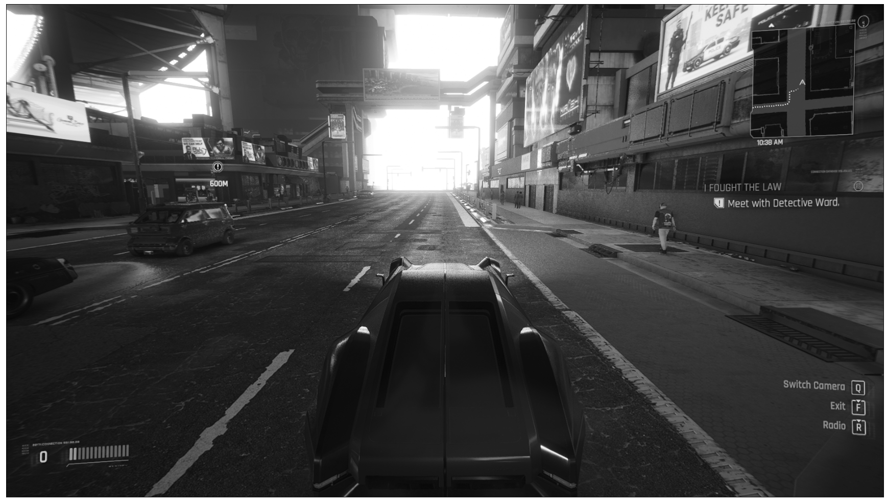
    


```python
# Оператор Робертса вариант 1
kernel_Roberts_x = np.array([
    [1, -1],
    [0, 0]
    ])
kernel_Roberts_y = np.array([
    [1, 0],
    [-1, 0]
    ])
kernel_Ku = 8.0

image_filtered = kernel_Ku * np.sqrt(
    np.power(cv2.filter2D(image, -1, kernel_Roberts_x), 2.0) + \
    np.power(cv2.filter2D(image, -1, kernel_Roberts_y), 2.0)
)
image_filtered = np.clip(np.round(image_filtered), 0, 255).astype(dtype=np.uint8)

if use_graph:
    figure(figsize=(32, 16), dpi=80)
    plt.imshow(cv2.cvtColor(image_filtered, cv2.COLOR_GRAY2RGB))
    plt.xticks([]),plt.yticks([])
    plt.show()
```


    
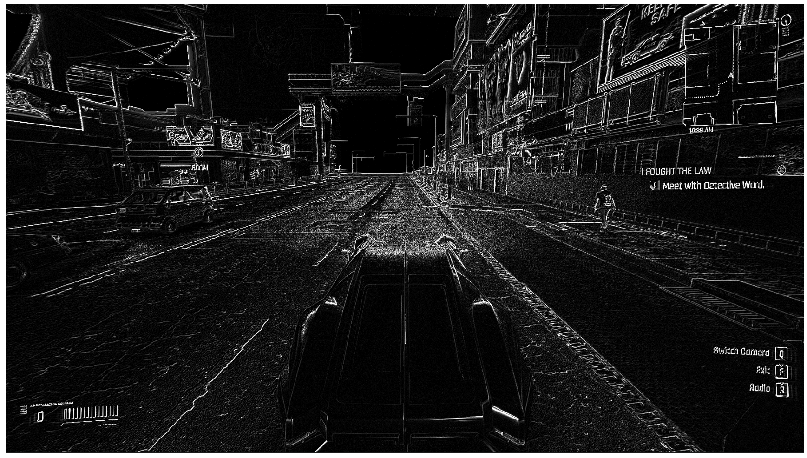
    


```python
# Оператор Робертса вариант 2
kernel_Roberts_x = np.array([
    [1, 0],
    [0, -1]
    ])
kernel_Roberts_y = np.array([
    [0, 1],
    [-1, 0]
    ])
kernel_Ku = 8.0

image_filtered = kernel_Ku * np.sqrt(
    np.power(cv2.filter2D(image, -1, kernel_Roberts_x), 2.0) + \
    np.power(cv2.filter2D(image, -1, kernel_Roberts_y), 2.0)
)
image_filtered = np.clip(np.round(image_filtered), 0, 255).astype(dtype=np.uint8)

if use_graph:
    figure(figsize=(32, 16), dpi=80)
    plt.imshow(cv2.cvtColor(image_filtered, cv2.COLOR_GRAY2RGB))
    plt.xticks([]),plt.yticks([])
    plt.show()
```


    
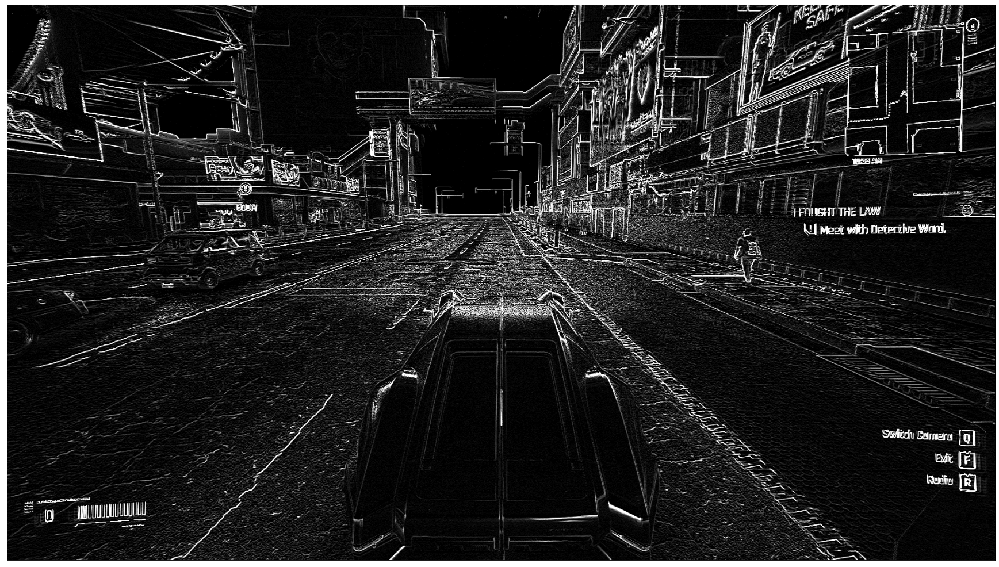
    


```python
# Оператор Робертса мой счетверённый вариант 2
kernel_Roberts_x = np.array([
    [1, 0],
    [0, -1]
    ])
kernel_Roberts_y = np.array([
    [0, 1],
    [-1, 0]
    ])
kernel_Ku = 4.0

image_filtered = kernel_Ku * np.sqrt(
    np.power(cv2.filter2D(image, -1, kernel_Roberts_x), 2.0) + \
    np.power(cv2.filter2D(image, -1, kernel_Roberts_y), 2.0) + \
    np.power(cv2.filter2D(image, -1, -kernel_Roberts_x), 2.0) + \
    np.power(cv2.filter2D(image, -1, -kernel_Roberts_y), 2.0)
)
image_filtered = np.clip(np.round(image_filtered), 0, 255).astype(dtype=np.uint8)

if use_graph:
    figure(figsize=(32, 16), dpi=80)
    plt.imshow(cv2.cvtColor(image_filtered, cv2.COLOR_GRAY2RGB))
    plt.xticks([]),plt.yticks([])
    plt.show()
```


    
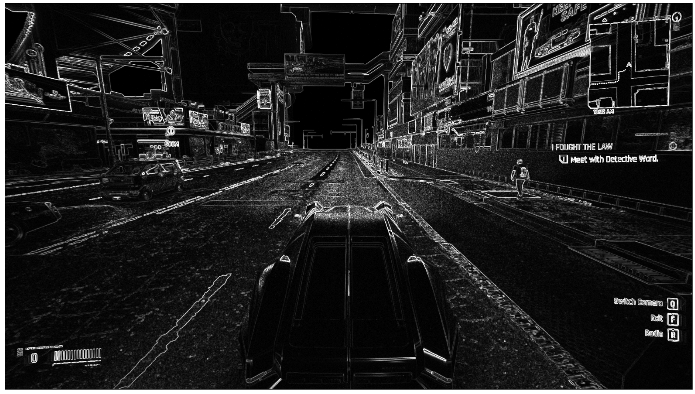
    


```python
# Оператор Робертса мой свосмерённый вариант 1 и 2
kernel_Roberts_x = np.array([
    [1, 0],
    [0, -1]
    ])
kernel_Roberts_y = np.array([
    [0, 1],
    [-1, 0]
    ])
kernel_Roberts2_x = np.array([
    [1, 0],
    [0, -1]
    ])
kernel_Roberts2_y = np.array([
    [0, 1],
    [-1, 0]
    ])
kernel_Ku = 2.0

image_filtered = kernel_Ku * np.sqrt(
    np.power(cv2.filter2D(image, -1, kernel_Roberts_x), 2.0) + \
    np.power(cv2.filter2D(image, -1, kernel_Roberts_y), 2.0) + \
    np.power(cv2.filter2D(image, -1, -kernel_Roberts_x), 2.0) + \
    np.power(cv2.filter2D(image, -1, -kernel_Roberts_y), 2.0) + \
    np.power(cv2.filter2D(image, -1, kernel_Roberts2_x), 2.0) + \
    np.power(cv2.filter2D(image, -1, kernel_Roberts2_y), 2.0) + \
    np.power(cv2.filter2D(image, -1, -kernel_Roberts2_x), 2.0) + \
    np.power(cv2.filter2D(image, -1, -kernel_Roberts2_y), 2.0)
)
image_filtered = np.clip(np.round(image_filtered), 0, 255).astype(dtype=np.uint8)

if use_graph:
    figure(figsize=(32, 16), dpi=80)
    plt.imshow(cv2.cvtColor(image_filtered, cv2.COLOR_GRAY2RGB))
    plt.xticks([]),plt.yticks([])
    plt.show()
```


    
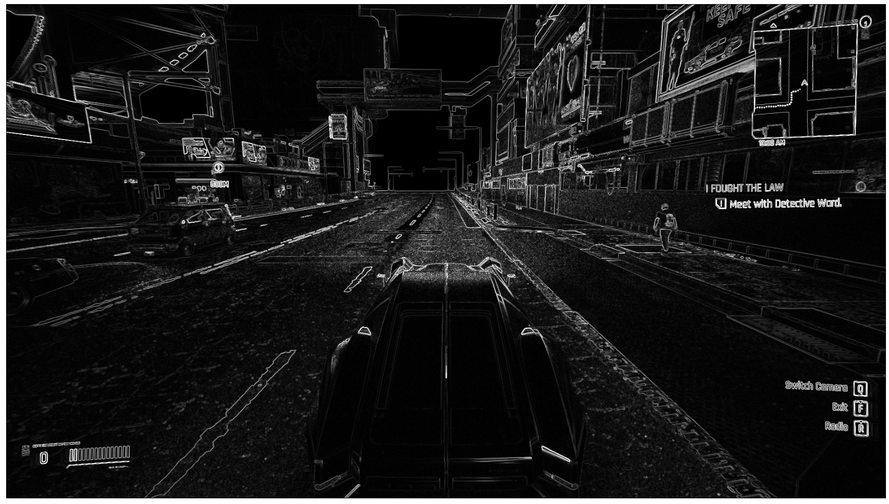
    


### 4.2 Фильтр Превитта


```python
# Оператор Превитта
kernel_Prewitt_x = np.array([
    [-1, 0, 1],
    [-1, 0, 1],
    [-1, 0, 1]])
kernel_Prewitt_y = np.array([
    [1, 1, 1],
    [0, 0, 0],
    [-1, -1, -1]])
kernel_Ku = 2.0

image_filtered = kernel_Ku * np.sqrt(
    np.power(cv2.filter2D(image, -1, kernel_Prewitt_x), 2.0) + \
    np.power(cv2.filter2D(image, -1, kernel_Prewitt_y), 2.0)
)
image_filtered = np.clip(np.round(image_filtered), 0, 255).astype(dtype=np.uint8)

if use_graph:
    figure(figsize=(32, 16), dpi=80)
    plt.imshow(cv2.cvtColor(image_filtered, cv2.COLOR_GRAY2RGB))
    plt.xticks([]),plt.yticks([])
    plt.show()
```


    
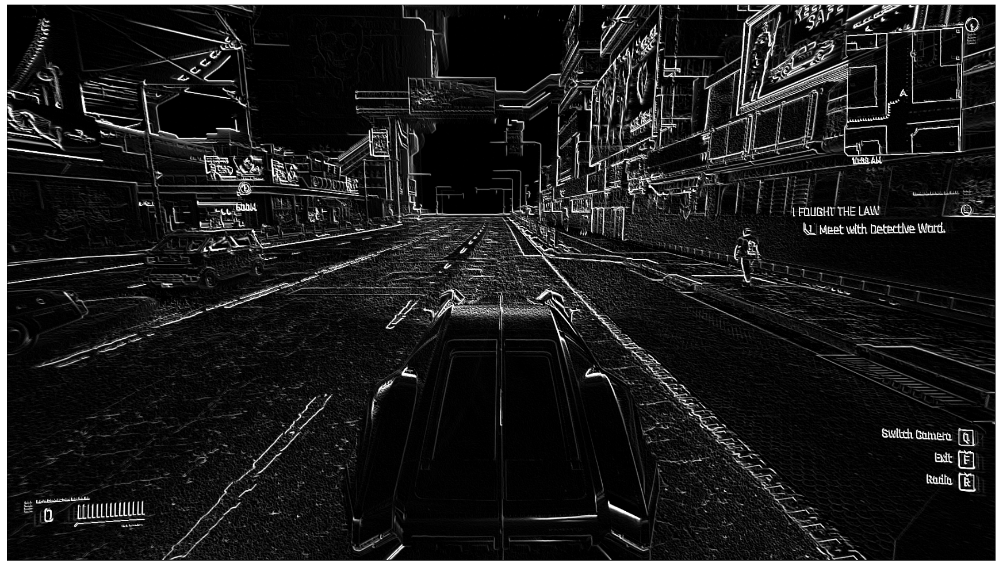
    


```python
# Оператор Превитта двунаправленный
kernel_Prewitt_x = np.array([
    [-1, 0, 1],
    [-1, 0, 1],
    [-1, 0, 1]])
kernel_Prewitt_y = np.array([
    [1, 1, 1],
    [0, 0, 0],
    [-1, -1, -1]])
kernel_Ku = 1.0

image_filtered = kernel_Ku * np.sqrt(
    np.power(cv2.filter2D(image, -1, kernel_Prewitt_x), 2.0) + \
    np.power(cv2.filter2D(image, -1, kernel_Prewitt_y), 2.0) + \
    np.power(cv2.filter2D(image, -1, -kernel_Prewitt_x), 2.0) + \
    np.power(cv2.filter2D(image, -1, -kernel_Prewitt_y), 2.0)
)
image_filtered = np.clip(np.round(image_filtered), 0, 255).astype(dtype=np.uint8)

if use_graph:
    figure(figsize=(32, 16), dpi=80)
    plt.imshow(cv2.cvtColor(image_filtered, cv2.COLOR_GRAY2RGB))
    plt.xticks([]),plt.yticks([])
    plt.show()
```


    
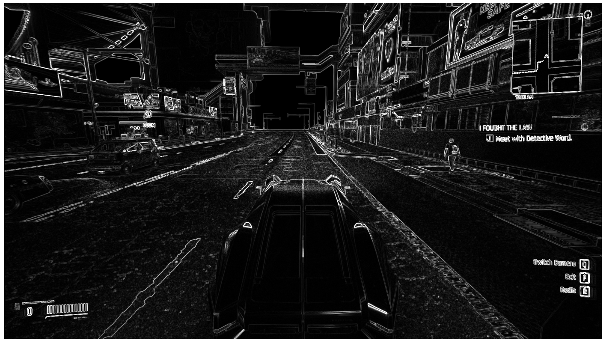
    


### 4.3 Фильтр Собела


```python
# Оператор Собела
kernel_Sobel_x = np.array([
    [-1, 0, 1],
    [-2, 0, 2],
    [-1, 0, 1]])
kernel_Sobel_y = np.array([
    [1, 2, 1],
    [0, 0, 0],
    [-1, -2, -1]])
kernel_Ku = 2.0

image_filtered = kernel_Ku * np.sqrt(
    np.power(cv2.filter2D(image, -1, kernel_Sobel_x), 2.0) + \
    np.power(cv2.filter2D(image, -1, kernel_Sobel_y), 2.0)
)
image_filtered = np.clip(np.round(image_filtered), 0, 255).astype(dtype=np.uint8)

if use_graph:
    figure(figsize=(32, 16), dpi=80)
    plt.imshow(cv2.cvtColor(image_filtered, cv2.COLOR_GRAY2RGB))
    plt.xticks([]),plt.yticks([])
    plt.show()
```


    
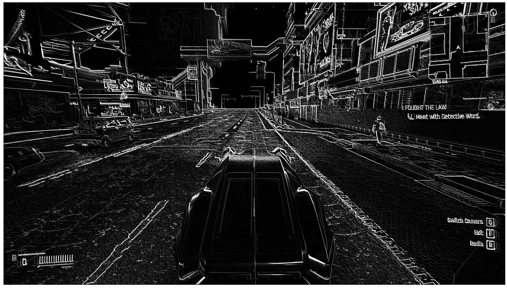
    


```python
# Оператор Собела двунаправленный
kernel_Sobel_x = np.array([
    [-1, 0, 1],
    [-2, 0, 2],
    [-1, 0, 1]])
kernel_Sobel_y = np.array([
    [1, 2, 1],
    [0, 0, 0],
    [-1, -2, -1]])
kernel_Ku = 1.0

image_filtered = kernel_Ku * np.sqrt(
    np.power(cv2.filter2D(image, -1, kernel_Sobel_x), 2.0) + \
    np.power(cv2.filter2D(image, -1, kernel_Sobel_y), 2.0) + \
    np.power(cv2.filter2D(image, -1, -kernel_Sobel_x), 2.0) + \
    np.power(cv2.filter2D(image, -1, -kernel_Sobel_y), 2.0) 
)
image_filtered = np.clip(np.round(image_filtered), 0, 255).astype(dtype=np.uint8)

if use_graph:
    figure(figsize=(32, 16), dpi=80)
    plt.imshow(cv2.cvtColor(image_filtered, cv2.COLOR_GRAY2RGB))
    plt.xticks([]),plt.yticks([])
    plt.show()
```


    

    


### 4.4 Фильтр Лапласа


```python
# Оператор Лапласа 1 порядка
kernel_Laplacian_1 = np.array([
    [0, 1, 0],
    [1, -4, 1],
    [0, 1, 0]])
kernel_Ku = 8.0

image_filtered = kernel_Ku * cv2.filter2D(image, -1, kernel_Laplacian_1)
image_filtered = np.clip(np.round(image_filtered), 0, 255).astype(dtype=np.uint8)

if use_graph:
    figure(figsize=(32, 16), dpi=80)
    plt.imshow(cv2.cvtColor(image_filtered, cv2.COLOR_GRAY2RGB))
    plt.xticks([]),plt.yticks([])
    plt.show()
```


    
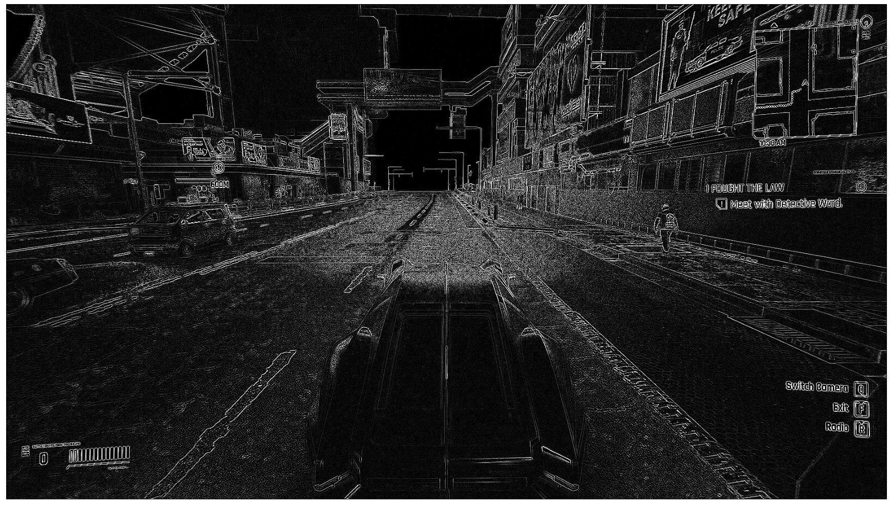
    


```python
# Оператор Лапласа 2 порядка
kernel_Laplacian_2 = np.array([
    [1, 1, 1],
    [1, -8, 1],
    [1, 1, 1]])
kernel_Ku = 4.0

image_filtered = kernel_Ku * cv2.filter2D(image, -1, kernel_Laplacian_2)
image_filtered = np.clip(np.round(image_filtered), 0, 255).astype(dtype=np.uint8)

if use_graph:
    figure(figsize=(32, 16), dpi=80)
    plt.imshow(cv2.cvtColor(image_filtered, cv2.COLOR_GRAY2RGB))
    plt.xticks([]),plt.yticks([])
    plt.show()
```


    
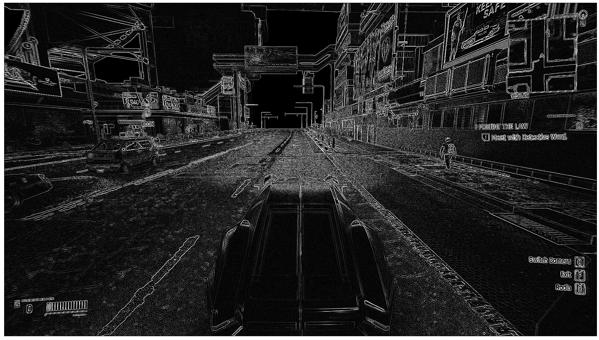
    


```python
# Оператор Лапласа 3 порядка
kernel_Laplacian_3 = np.array([
    [2, -1, 2],
    [-1, -4, -1],
    [2, -1, 2]])
kernel_Ku = 4.0

image_filtered = kernel_Ku * cv2.filter2D(image, -1, kernel_Laplacian_3)
image_filtered = np.clip(np.round(image_filtered), 0, 255).astype(dtype=np.uint8)

if use_graph:
    figure(figsize=(32, 16), dpi=80)
    plt.imshow(cv2.cvtColor(image_filtered, cv2.COLOR_GRAY2RGB))
    plt.xticks([]),plt.yticks([])
    plt.show()
```


    
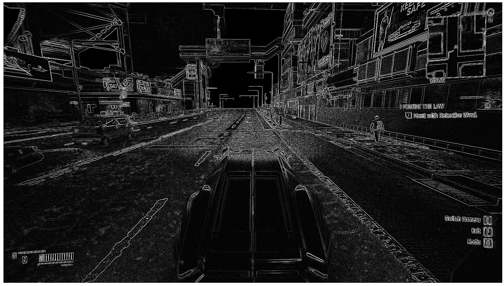
    


```python
# Оператор Лапласа 4 порядка
kernel_Laplacian_4 = np.array([
    [-1, 2, -1],
    [2, -4, 2],
    [-1, 2, -1]])
kernel_Ku = 8.0

image_filtered = kernel_Ku * cv2.filter2D(image, -1, kernel_Laplacian_4)
image_filtered = np.clip(np.round(image_filtered), 0, 255).astype(dtype=np.uint8)

if use_graph:
    figure(figsize=(32, 16), dpi=80)
    plt.imshow(cv2.cvtColor(image_filtered, cv2.COLOR_GRAY2RGB))
    plt.xticks([]),plt.yticks([])
    plt.show()
```


    
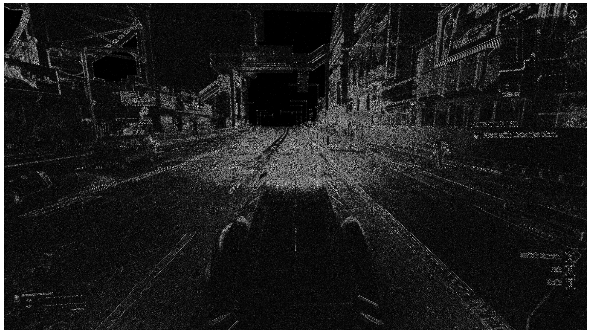
    


### 4.5 Фильтр Кенни


```python
image = cv2.GaussianBlur(image, (5, 5), 0)

threshold1 = 10.0
threshold2 = 20.0
print(f"threshold1 = {threshold1}, threshold2 = {threshold2}")
if use_graph:
    figure(figsize=(32, 16), dpi=80)
    plt.imshow(cv2.cvtColor(cv2.Canny(image, threshold1, threshold2), cv2.COLOR_GRAY2RGB))
    plt.xticks([]),plt.yticks([])
    plt.show()
```

    threshold1 = 10.0, threshold2 = 20.0
    


    
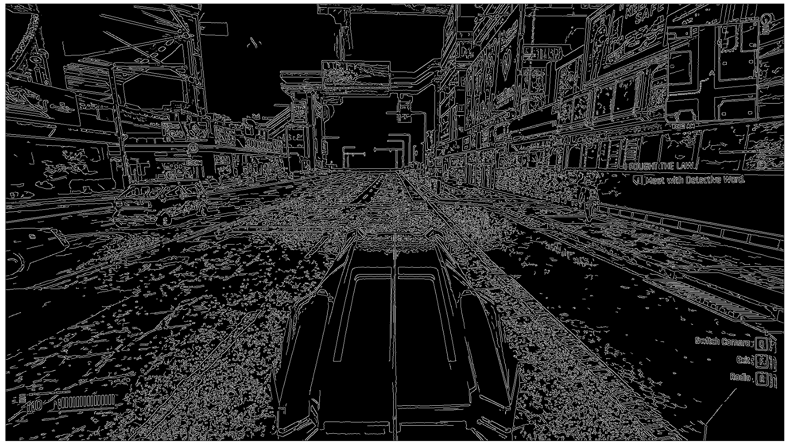
    


```python
threshold1 = 30.0
threshold2 = 70.0
print(f"threshold1 = {threshold1}, threshold2 = {threshold2}")
if use_graph:
    figure(figsize=(32, 16), dpi=80)
    plt.imshow(cv2.cvtColor(cv2.Canny(image, threshold1, threshold2), cv2.COLOR_GRAY2RGB))
    plt.xticks([]),plt.yticks([])
    plt.show()
```

    threshold1 = 30.0, threshold2 = 70.0
    


    
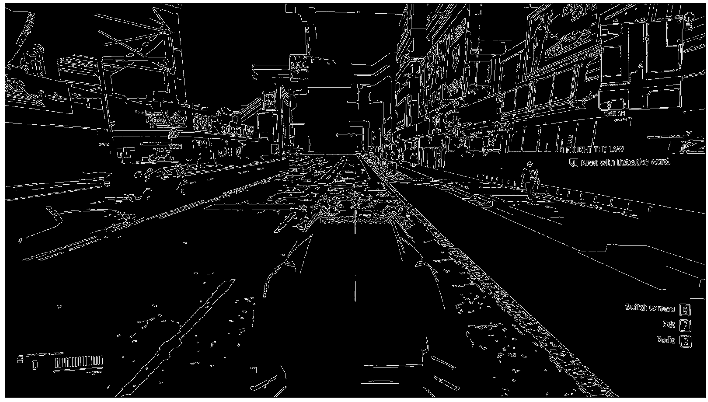
    


```python
threshold1 = 100.0
threshold2 = 200.0
print(f"threshold1 = {threshold1}, threshold2 = {threshold2}")
if use_graph:
    figure(figsize=(32, 16), dpi=80)
    plt.imshow(cv2.cvtColor(cv2.Canny(image, threshold1, threshold2), cv2.COLOR_GRAY2RGB))
    plt.xticks([]),plt.yticks([])
    plt.show()
```

    threshold1 = 100.0, threshold2 = 200.0
    


    
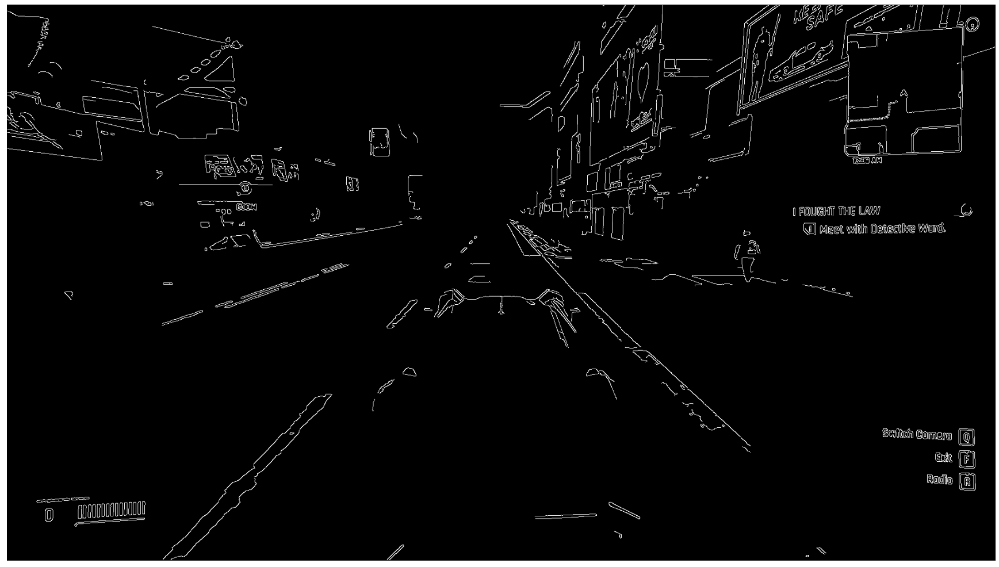
    


```python
threshold1 = 200.0
threshold2 = 300.0
print(f"threshold1 = {threshold1}, threshold2 = {threshold2}")
if use_graph:
    figure(figsize=(32, 16), dpi=80)
    plt.imshow(cv2.cvtColor(cv2.Canny(image, threshold1, threshold2), cv2.COLOR_GRAY2RGB))
    plt.xticks([]),plt.yticks([])
    plt.show()
```

    threshold1 = 200.0, threshold2 = 300.0
    


    
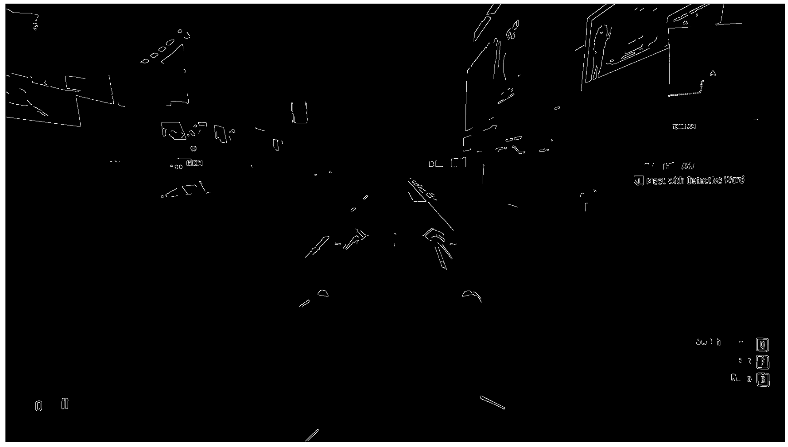
    


```python
threshold1 = 30.0
threshold2 = 100.0
print(f"threshold1 = {threshold1}, threshold2 = {threshold2}")
if use_graph:
    figure(figsize=(32, 16), dpi=80)
    plt.imshow(cv2.cvtColor(cv2.Canny(image, threshold1, threshold2), cv2.COLOR_GRAY2RGB))
    plt.xticks([]),plt.yticks([])
    plt.show()
```

    threshold1 = 30.0, threshold2 = 100.0
    


    
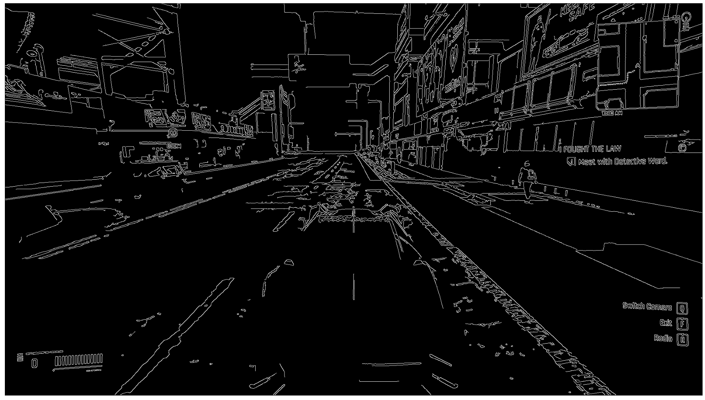
    


```python
threshold1 = 100.0
threshold2 = 30.0
print(f"threshold1 = {threshold1}, threshold2 = {threshold2}")
if use_graph:
    figure(figsize=(32, 16), dpi=80)
    plt.imshow(cv2.cvtColor(cv2.Canny(image, threshold1, threshold2), cv2.COLOR_GRAY2RGB))
    plt.xticks([]),plt.yticks([])
    plt.show()
```

    threshold1 = 100.0, threshold2 = 30.0
    


    

    

