### Листинг 1. Базовые морфологические операции

Термин морфология дословно переводится как «наука о форме».
Морфологический анализ используется во многих областях знаний,
в т.ч. и в обработке изображений. Морфологический анализ является относительно универсальным подходом,
поэтому стоит обособленно от всех рассмотренных ранее методов. С использованием математической морфологии при обработке
изображений можно осуществлять фильтрацию шумов, сегментацию объектов, выделение
контуров, реализовать поиск заданного объекта на изображении,
вычислить «скелет» образа и т.д. 

Рассмотрим основные операции
бинарной морфологии над изображением A структурным элементом B:

1. Дилатация (расширение, наращивание): 𝐴 ⊕ 𝐵, 
расширяет бинарный образ 𝐴 структурным элементом 𝐵;

2. Эрозия (сжатие, сужение): 𝐴 ⊖ 𝐵, сужает бинарный образ 𝐴 структурным элементом 𝐵;

3. Открытие (отмыкание, размыкание, раскрытие): (𝐴 ⊖ 𝐵) ⊕ 𝐵, 
удаляет внешние дефекты бинарного образа 𝐴 структурным элементом 𝐵;

4. Закрытие (замыкание): (𝐴 ⊕ 𝐵) ⊖ 𝐵, 
удаляет внутренние дефекты бинарного образа 𝐴 структурным элементом 𝐵.

где ⊕ и ⊖ — сложение и вычитание Минковского, соответственно.


```python
import imutils
import cv2
import os
import skimage.color
import skimage.segmentation
import skimage.measure
import skimage.feature
import skimage.morphology
import scipy.ndimage
import numpy as np
from matplotlib import pyplot as plt
from matplotlib.pyplot import figure
import warnings
warnings.filterwarnings('ignore')
export_parallel = True
use_graph = True
```


```python
# Исходное изображение
image = cv2.imread("data/oranges.jpg")
```

Попробую выделить по цвету апельсины на изображении.


```python
if use_graph:
    figure(figsize=(32, 16), dpi=80)
    plt.imshow(cv2.cvtColor(image, cv2.COLOR_BGR2RGB))
    plt.xticks([]),plt.yticks([])
    plt.show()
```


​    
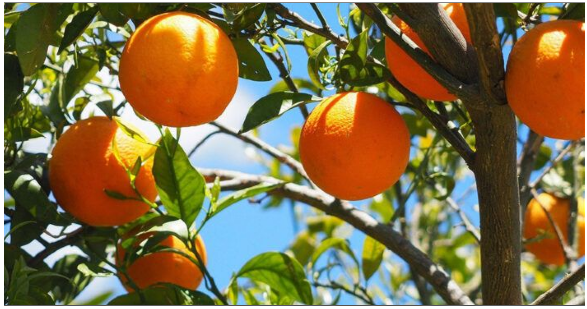
​    


```python
# Перевод в пространство HSV
image = cv2.cvtColor(np.float32(image / 255.0), cv2.COLOR_BGR2HSV)

# Фильтрация по Гауссу
image = cv2.GaussianBlur(image, (5, 5), 1)

# Создание маски
image_mask = np.logical_and(
    np.logical_or(image[:,:,0] < 50.0, image[:,:,0] > 345.0), # Hue < 50 or Hue > 345
    np.logical_and(
        image[:,:,1] > 0.4, # Saturation > 0.3
        image[:,:,2] > 0.4, # Lightness > 0.25
    )
)
```


```python
# Результат до морфологической фильтрации
if use_graph:
    figure(figsize=(32, 16), dpi=80)
    plt.imshow(cv2.cvtColor(cv2.bitwise_and(image, image, mask=np.uint8(image_mask * 255)), cv2.COLOR_HSV2RGB))
    plt.xticks([]),plt.yticks([])
    plt.show()
```


​    
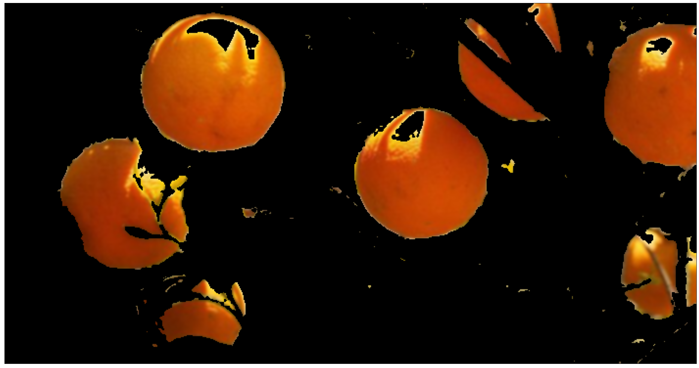
​    


```python
# Открытие (отмыкание, размыкание, раскрытие): (𝐴 ⊖ 𝐵) ⊕ 𝐵
selem = skimage.morphology.disk(7)
image_mask = skimage.morphology.erosion(image_mask, selem)
image_mask = skimage.morphology.dilation(image_mask, selem)

# Закрытие (замыкание): (𝐴 ⊕ 𝐵) ⊖ 𝐵
selem = skimage.morphology.disk(11)
image_mask = skimage.morphology.dilation(image_mask, selem)
image_mask = skimage.morphology.erosion(image_mask, selem)

# Находит набор это набор пикселей, входящих в наименьший выпуклый многоугольник, 
# который окружает все белые пиксели входного изображения. 
# Выполняется индивидуально для каждого несвязного множества кипселей
image_mask = skimage.morphology.convex_hull_object(image_mask)
```


```python
# Результат после морфологической фильтрации
if use_graph:
    figure(figsize=(32, 16), dpi=80)
    image_to_show = cv2.bitwise_and(image, image, mask=np.uint8(image_mask * 255))
    plt.imshow(cv2.cvtColor(image_to_show, cv2.COLOR_HSV2RGB))
    plt.xticks([]),plt.yticks([])
    plt.show()
```


​    
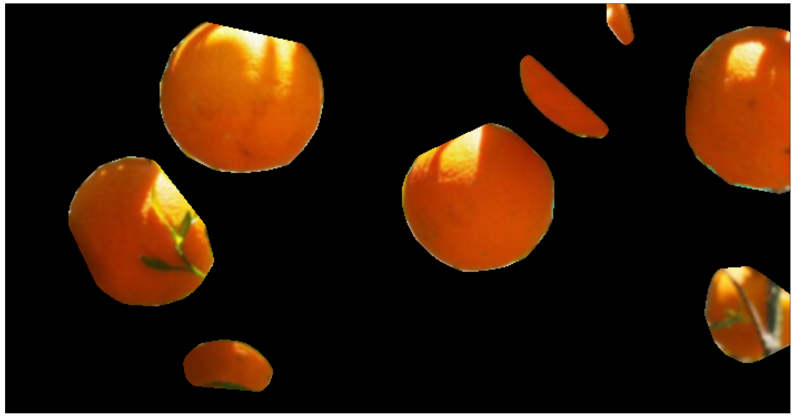
​    


Результат хороший, но частично видимый апельсин справа сверзу распался на 2 части, 
хотя распознался апельсин, даже сильно перекрытый деревом справа снизу.

### Листинг 2. Разделение «склеенных» объектов

Одним из примеров использования морфологических операций
над изображением может быть задача разделения склеившихся на
изображении объектов. Задача может быть решена с достаточной 
степенью точности при помощи последовательного выполнения
нескольких раз фильтра сжатия, а затем максимально возможного
расширения полученного результата. Пересечение исходного изображения 
с обработанным позволит разделить склеенные объекты.


```python
# Исходное изображение
image = cv2.imread("data/coins.jpg")
```

На следующем изображении будет задача разделить изображение на непересекающиеся области.


```python
if use_graph:
    figure(figsize=(32, 16), dpi=80)
    plt.imshow(cv2.cvtColor(image, cv2.COLOR_BGR2RGB))
    plt.xticks([]),plt.yticks([])
    plt.show()
```


​    
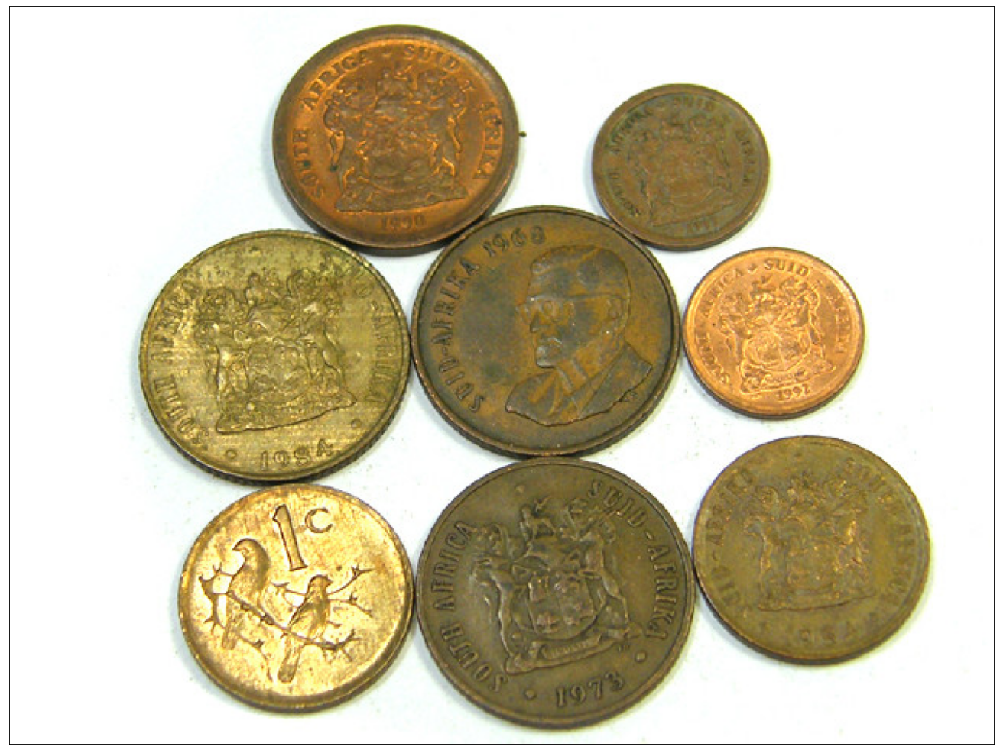
​    


```python
# Перевод в пространство HSV
image = cv2.cvtColor(np.float32(image / 255.0), cv2.COLOR_BGR2HSV)

# Создание маски
image_mask = image[:,:,1] > 0.15 # Saturation > 0.1
```


```python
# Вид маски до морфологической фильтрации
if use_graph:
    figure(figsize=(32, 16), dpi=80)
    plt.imshow(cv2.cvtColor(np.uint8(image_mask * 255), cv2.COLOR_GRAY2RGB))
    plt.xticks([]),plt.yticks([])
    plt.show()
```


​    
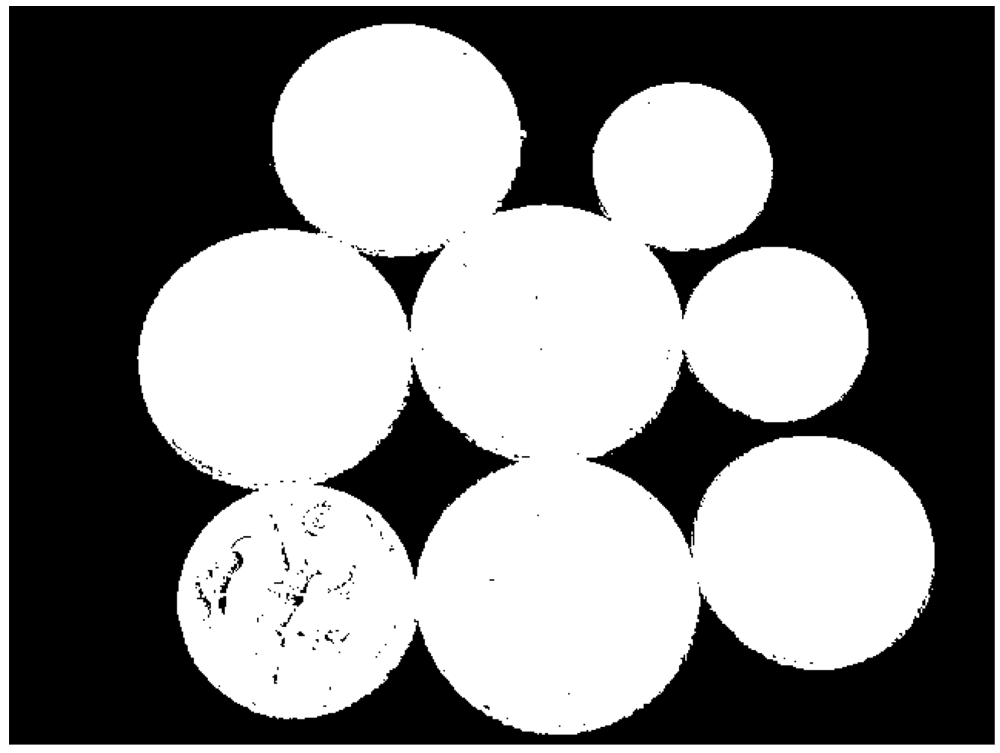
​    


```python
# Слабое закрытие (замыкание): (𝐴 ⊕ 𝐵) ⊖ 𝐵
selem = skimage.morphology.disk(3)
image_mask = skimage.morphology.dilation(image_mask, selem)
image_mask = skimage.morphology.erosion(image_mask, selem)

expanded = image_mask.copy()

# Многократное сжатие
selem = skimage.morphology.disk(5)
for i in range(7):
    expanded = skimage.morphology.erosion(expanded, selem)

# Расширение до пересечения через дополнительный массив, чтобы края изображения не портили результат.
if use_graph:
    size=np.array(expanded.shape)
    expanded_huge = np.zeros(shape=size * 3, dtype=np.bool)
    expanded_huge[size[0]:2*size[0], size[1]:2*size[1]] = expanded
    expanded = expanded_huge
    expanded_huge = np.logical_not(expanded_huge)
    expanded_huge = skimage.morphology.thin(expanded_huge)
    expanded_huge = np.logical_not(expanded_huge)
    expanded = expanded_huge[size[0]:2*size[0], size[1]:2*size[1]]
    image_mask = np.logical_and(image_mask, expanded)

# Слабая эрозия: 𝐴 ⊖ 𝐵
selem = skimage.morphology.disk(3)
image_mask = skimage.morphology.erosion(image_mask, selem)
```


```python
# Вид маски после морфологической фильтрации
if use_graph:
    figure(figsize=(32, 16), dpi=80)
    plt.imshow(cv2.cvtColor(np.uint8(image_mask * 255), cv2.COLOR_GRAY2RGB))
    plt.xticks([]),plt.yticks([])
    plt.show()
```


​    
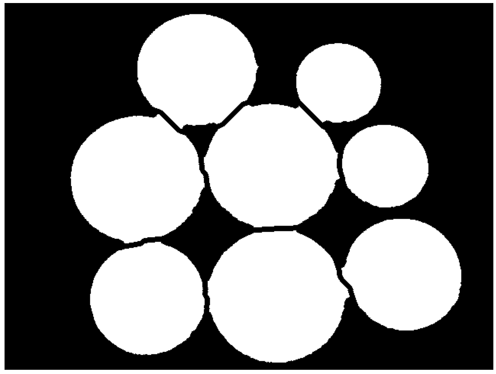
​    


```python
# Результат после морфологической фильтрации и выделения контуров
if use_graph:
    figure(figsize=(32, 16), dpi=80)
    thresh = cv2.threshold(np.uint8(image_mask * 255), 0, 255, cv2.THRESH_BINARY | cv2.THRESH_OTSU)
    print(thresh[1])
    cnts = cv2.findContours(thresh[1], cv2.RETR_EXTERNAL, cv2.CHAIN_APPROX_SIMPLE)
    cnts = imutils.grab_contours(cnts)
    image_to_show = cv2.cvtColor(image, cv2.COLOR_HSV2BGR)
    for (i, c) in enumerate(cnts):
        # draw the contour
        ((x, y), _) = cv2.minEnclosingCircle(c)
        cv2.putText(image_to_show, "#{}".format(i + 1), (int(x) - 10, int(y)),
            cv2.FONT_HERSHEY_SIMPLEX, 0.9, (0, 0, 255), 2)
        cv2.drawContours(image_to_show, [c], -1, (0, 255, 0), 2)
    plt.imshow(cv2.cvtColor(image_to_show, cv2.COLOR_BGR2RGB))
    plt.xticks([]),plt.yticks([])
    plt.show()
```

    Clipping input data to the valid range for imshow with RGB data ([0..1] for floats or [0..255] for integers).


    [[0 0 0 ... 0 0 0]
     [0 0 0 ... 0 0 0]
     [0 0 0 ... 0 0 0]
     ...
     [0 0 0 ... 0 0 0]
     [0 0 0 ... 0 0 0]
     [0 0 0 ... 0 0 0]]


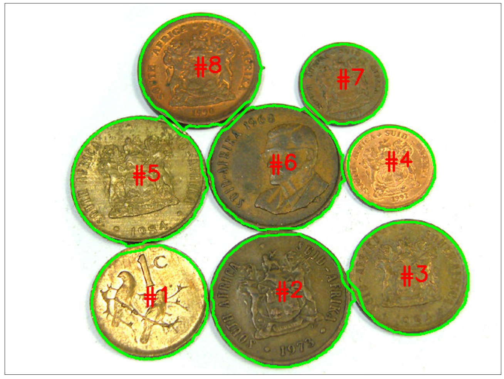
    


Результат разделения объектов получился на удивление хорошим, хотя и на месте стыка присутствуют неровности.

Главным недостатком такого метода является скорость работы, так как функция skimage.morphology.thin 
мало того что для корректного расширения должна вызывать себя несколько сотен раз, так и ещё и в skimage нет нужной
функции, и поэтому пришлось расширять пространство в 9 раз, чтобы края не вносили свой вклад. 
Этого можно было избежать, если вручную поменять код функции skimage.morphology.thin 
или написать нужную функцию с нуля.

### Листинг 3. Сегментация изображения по водоразделам

Рассмотрим еще один из примеров применения математической
морфологии к задаче сегментации изображения. В подходе сегментации по водоразделам изображение рассматривается 
как карта высот, на котором интенсивности пикселей описывают высоты относительно некоторого уровня. 
На такую «высотную местность» «льет
дождь», образуя множество водосборных бассейнов. Постепенно вода из переполненных бассейнов переливается, 
и бассейны объединяются в более крупные. Места объединения бассейнов
отмечаются как линии водораздела. Если «дождь» остановить рано, тогда изображение будет сегментировано 
на мелкие области, а
если поздно — на крупные. В таком подходе все пиксели подразделяются на три типа:

1. локальные минимумы;

2. находящиеся на склоне (с которых вода скатывается в один и
тот же локальный минимум);

3. локальные максимумы (с которых вода скатывается более чем
в один минимум).

При реализации данного метода необходимо определить водосборные бассены и линии водораздела путем обработки локальных
областей и вычисления их характеристик. Алгоритм сегментации состоит из следующих шагов:

1. Вычисление функции сегментации. Как правило, для этого
используется градиентное представление изображения.

2. Вычисление маркеров переднего плана на основании связности пикселей каждого объекта.

3. Вычисление маркеров фона, представляющих пиксели, не являющиеся объектами.

4. Модифицирование функции сегментации с учетом взаиморасположения маркеров переднего плана и фона.

В результате работы алгоритма будет получена маска, где пиксели одинаковых сегментов будут помечены одинаковыми метками
и будут образовывать связную область.


```python
# Исходное изображение
image = cv2.imread("data/coins_2.jpg")
```

Попробую сегментировать методом водораздела монеты.


```python
if use_graph:
    figure(figsize=(32, 16), dpi=80)
    plt.imshow(cv2.cvtColor(image, cv2.COLOR_BGR2RGB))
    plt.xticks([]),plt.yticks([])
    plt.show()
```


​    
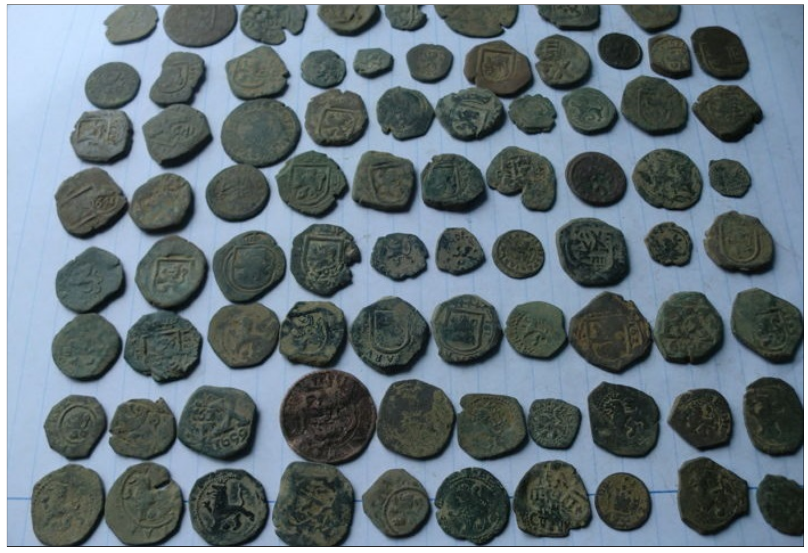
​    


```python
# Перевод в пространство HSV
image = cv2.cvtColor(np.float32(image / 255.0), cv2.COLOR_BGR2HSV)

# Создание маски для цвета яблок
image_mask = image[:,:,2] < 0.6

# Открытие (отмыкание, размыкание, раскрытие): (𝐴 ⊖ 𝐵) ⊕ 𝐵
selem = skimage.morphology.disk(11)
image_mask = skimage.morphology.erosion(image_mask, selem)
image_mask = skimage.morphology.dilation(image_mask, selem)
```


```python
# Вид маски после морфологической фильтрации, но до сегментации водоразделом
if use_graph:
    figure(figsize=(32, 16), dpi=80)
    plt.imshow(cv2.cvtColor(np.uint8(image_mask * 255), cv2.COLOR_GRAY2RGB))
    plt.xticks([]),plt.yticks([])
    plt.show()
```


​    
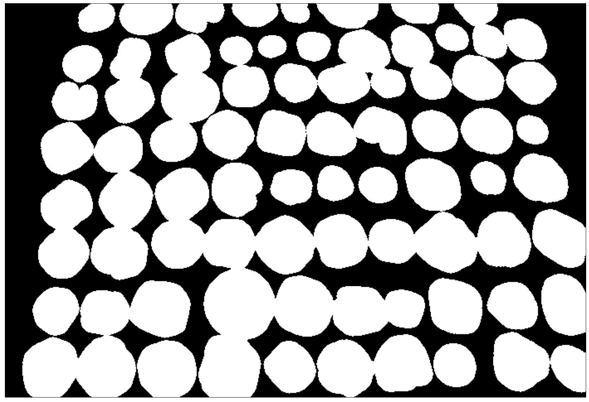
​    


```python
# Составление рельефа
D = scipy.ndimage.distance_transform_edt(image_mask * 1)
```


```python
# *Глубина* впадины, куда будет стекать вода
if use_graph:
    figure(figsize=(32, 16), dpi=80)
    D_heat = np.float32(D / np.max(D))
    heat = cv2.applyColorMap(np.uint8(D_heat * 255), cv2.COLORMAP_JET)
    plt.imshow(cv2.cvtColor(heat, cv2.COLOR_BGR2RGB))
    plt.xticks([]),plt.yticks([])
    plt.show()
```


​    
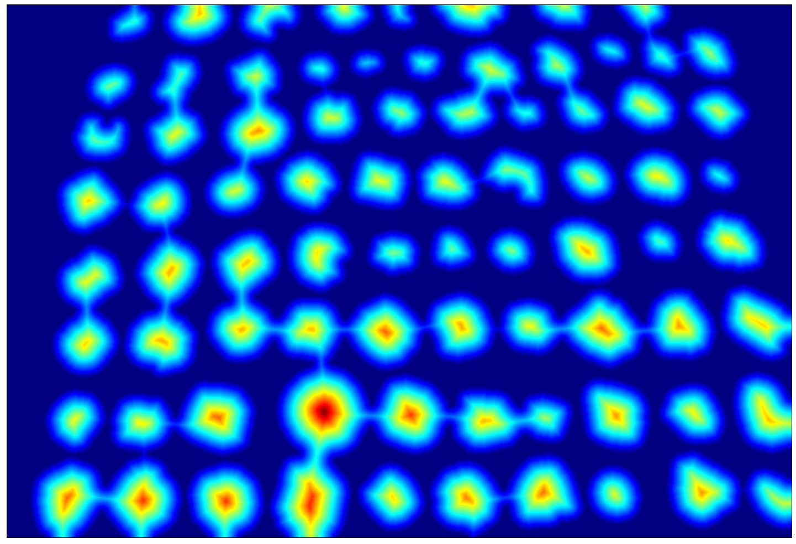
​    


```python
# Выбор локальных минимумов рельефа
localMax = skimage.feature.peak_local_max(D, indices=False, min_distance=15, labels=image_mask)
markers = scipy.ndimage.label(localMax, structure=np.ones((3, 3)))[0]
```


```python
# Локальные минимумы рельефа в виде точек
if use_graph:
    figure(figsize=(32, 16), dpi=80)
    image_to_show = markers
    selem = skimage.morphology.disk(7)
    image_to_show = skimage.morphology.dilation(image_to_show, selem)
    image_to_show = cv2.cvtColor(np.uint8(image_to_show * 255), cv2.COLOR_GRAY2RGB)
    plt.imshow(image_to_show)
    plt.xticks([]),plt.yticks([])
    plt.show()
```


​    
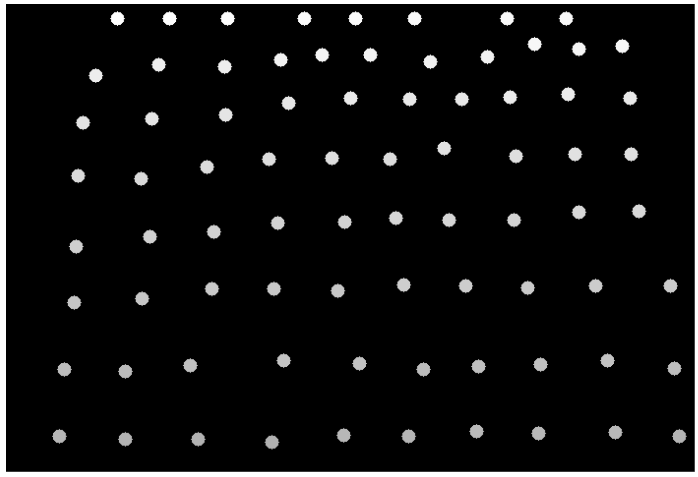
​    


```python
# Выполнение сегментации водоразделом
labels = skimage.segmentation.watershed(-D, markers, mask=image_mask)

```


```python
# Результат сегментации водоразделом
if use_graph:
    figure(figsize=(32, 16), dpi=80)
    labels_colored = np.zeros_like(labels, dtype=np.uint8)
    labels_colored = cv2.cvtColor(labels_colored, cv2.COLOR_GRAY2RGB)
    for label in np.unique(labels):
        if label == 0:
            continue
        labels_colored[labels == label] = np.uint8(np.round((np.random.rand(3) * 255)))
    plt.imshow(labels_colored)
    plt.xticks([]),plt.yticks([])
    plt.show()
```


​    
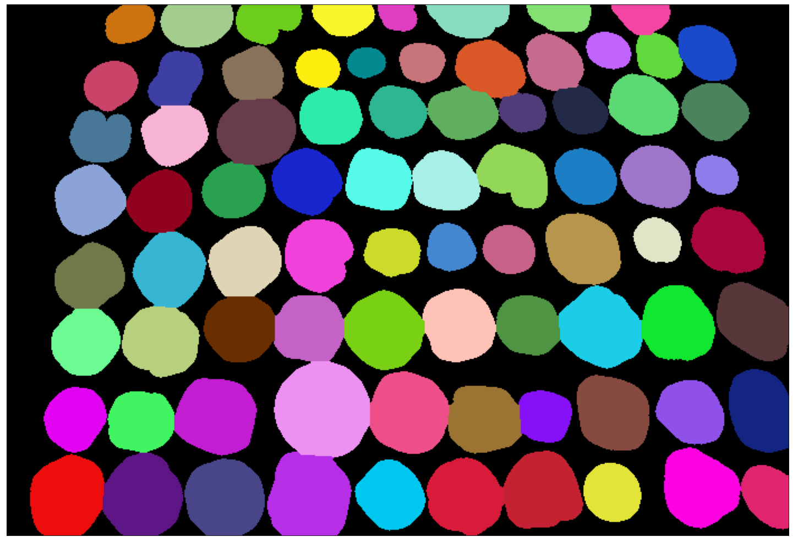
​    


```python
# Результат после сегментации водоразделом и выделения контуров
if use_graph:
    figure(figsize=(32, 16), dpi=80)
    image_to_show = cv2.cvtColor(image, cv2.COLOR_HSV2BGR)
    label_count = 0
    for label in np.unique(labels):
        if label == 0:
            continue
        mask = np.zeros(image_mask.shape, dtype="uint8")
        mask[labels == label] = 255
        cnts = cv2.findContours(mask.copy(), cv2.RETR_EXTERNAL, cv2.CHAIN_APPROX_SIMPLE)
        cnts = imutils.grab_contours(cnts)
        c = max(cnts, key=cv2.contourArea)
        ((x, y), r) = cv2.minEnclosingCircle(c)
        cv2.circle(image_to_show, (int(x), int(y)), int(r), (0, 255, 0), 2)
        cv2.putText(image_to_show, "#{}".format(label), (int(x) - 10, int(y)),
            cv2.FONT_HERSHEY_SIMPLEX, 0.6, (0, 0, 255), 2)
        label_count = label
    plt.imshow(cv2.cvtColor(image_to_show, cv2.COLOR_BGR2RGB))
    plt.xticks([]),plt.yticks([])
    plt.show()
    print(f"label_count = {label_count}")
```

    Clipping input data to the valid range for imshow with RGB data ([0..1] for floats or [0..255] for integers).


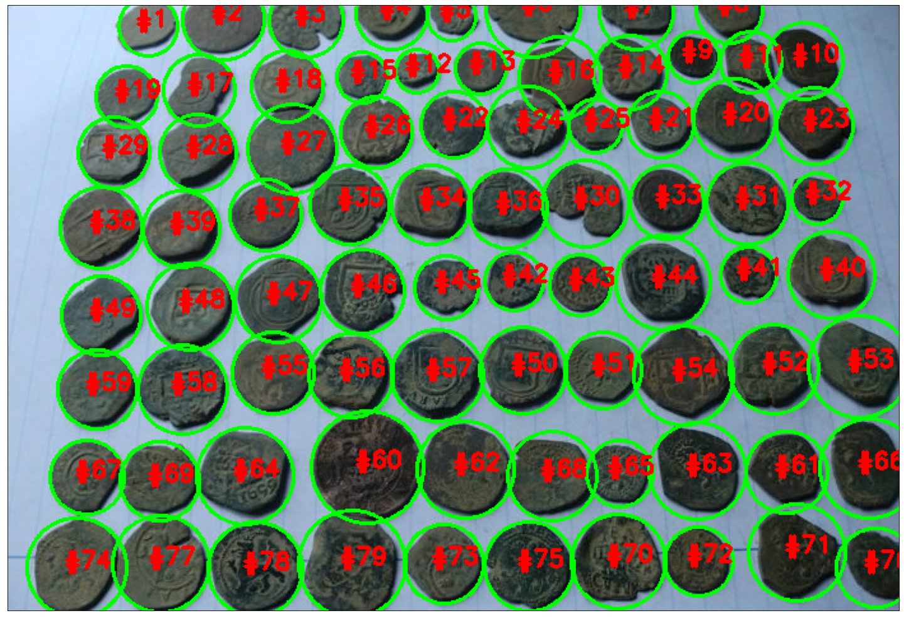
    


    label_count = 79

